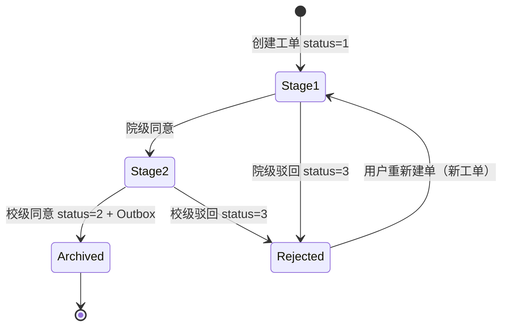

# FAMS 工作流审批规则（v1）

> 对应 `workflow_request.type`：1-领用, 2-归还, 3-报修, 4-报废  
> 审批链：**院级初审（stage=1）→ 校级复审（stage=2）→ 归档（stage=3）**  
> **v1 不实现转办**，见 `01-desgin.md` §7.11

---

## 1. 通用规则

### 1.1 工单状态字段

| 字段 | 值 | 含义 |
| --- | --- | --- |
| status | 1 | 审批中 |
| status | 2 | 审批通过（已归档） |
| status | 3 | 已被驳回 |
| current_stage | 1 | 待院级初审 |
| current_stage | 2 | 待校级复审 |
| current_stage | 3 | 归档结束 |

### 1.2 防重复

同一 `asset_id` 在 `status=1` 时只能有 **1** 张工单（DB 部分唯一索引）。

驳回后（status=3）**允许立即**重新申请。

### 1.3 审批权限

| 操作 | role=1 校级 | role=2 院级 |
| --- | --- | --- |
| 院级 approve/reject（stage=1） | 不允许 | 允许，且 `department_id IN 子树` |
| 校级 approve/reject（stage=2） | 允许 | 不允许 |
| 对已归档工单操作 | 42202 | 42202 |

### 1.4 驳回

- `status → 3`，`current_stage` **保持不变**（便于审计看卡在哪一阶段）
- 必须写 `workflow_log`，action=`院级初审驳回` 或 `校级复审驳回`
- **不**产生 Outbox 事件，**不**改资产台账

### 1.5 终审通过（stage=2 → 归档）

同一 PG 事务内：

1. 再次调用 `asset-rpc.CheckAssetForWorkflow`（type=工单类型）
2. `workflow_request.status=2`, `current_stage=3`, `updated_at=now()`
3. INSERT `workflow_log`（action=`校级复审通过`）
4. INSERT `workflow_outbox`（event 见 §3）

---

## 2. 建单前置校验（CheckAssetForWorkflow）

建单前 `workflow-rpc` 必须调用 `asset-rpc.CheckAssetForWorkflow(asset_id, type, requester_id)`。

### 2.1 领用（type=1）

| 条件 | 要求 |
| --- | --- |
| asset.status | = 1（在库） |
| asset.deleted_at | IS NULL |
| asset.user_id | IS NULL |
| 开放工单 | 无 status=1 工单 |

失败 → **42201**「资产当前不可领用」

### 2.2 归还（type=2）

| 条件 | 要求 |
| --- | --- |
| asset.status | = 2（领用中） |
| asset.user_id | = requester_id（必须本人归还） |
| 开放工单 | 无 status=1 工单 |

失败 → **42201**「您不是该资产当前领用人，无法归还」

### 2.3 报修（type=3）

| 条件 | 要求 |
| --- | --- |
| asset.status | IN (1, 2)（在库或领用中均可报修） |
| asset.deleted_at | IS NULL |
| 若 status=2 | user_id 必须 = requester_id 或 requester 为院级管理员 |
| 开放工单 | 无 status=1 工单 |

失败 → **42201**「资产当前不可报修」

### 2.4 报废（type=4）

| 条件 | 要求 |
| --- | --- |
| asset.status | IN (1, 3)（在库或维修中；领用中需先归还） |
| asset.deleted_at | IS NULL |
| 开放工单 | 无 status=1 工单 |

失败 → **42201**「资产当前不可报废」

---

## 3. 终审 Outbox 事件映射

Kafka Topic：`fams-asset-lifecycle-events`  
分区键：`asset_id`（字符串）

| type | event_type | target_status | assigned_user_id |
| --- | --- | --- | --- |
| 1 领用 | ASSET_USE_APPROVED | 2 | requester_id |
| 2 归还 | ASSET_RETURN_APPROVED | 1 | 0（清空 user_id） |
| 3 报修 | ASSET_REPAIR_APPROVED | 3 | 保持原 user_id 不变 |
| 4 报废 | ASSET_SCRAP_APPROVED | 4 | 0 |

**Payload 统一结构**：

```json
{
  "event_type": "ASSET_USE_APPROVED",
  "request_id": 88001,
  "asset_id": 501,
  "target_status": 2,
  "assigned_user_id": 10003,
  "operator_id": 10001,
  "timestamp": 1720236000
}
```

---

## 4. 资产消费端状态变更（asset-rpc）

消费事件后，在 MySQL 事务内：

1. INSERT `asset_event_dedup`（幂等）
2. UPDATE `asset_ledger SET status=target_status, user_id=assigned_user_id`（assigned_user_id=0 则 SET NULL）

**状态机校验**（与 `03-api-contract` 一致）：

| 当前 | 允许 target |
| --- | --- |
| 1 | 2, 3, 4 |
| 2 | 1, 3 |
| 3 | 1, 2, 4 |
| 4 | 无 |

非法 → 记录告警日志，ACK 消息（避免死循环），人工对账

---

## 5. 院级初审通过（stage 1→2）

- 仅 role=2，且 `workflow.department_id IN 管理员子树`
- 资产 **不再重复校验**（建单已校验）
- UPDATE `current_stage=2`, `updated_at=now()`
- INSERT log：action=`院级初审同意`

---

## 6. 特殊场景

| 场景 | 处理 |
| --- | --- |
| 审批中管理员修改资产 departmentId | 42201 禁止（PUT asset 校验存在 open workflow） |
| 审批中资产被逻辑删除 | 42202 终审 Check 失败，工单保持 stage=2，人工处理 |
| 终审时资产已被另一通过工单改状态 | Check 失败 → 42201，不提交事务 |
| 校级管理员代提交报废 | 不允许，type=4 仅 role=3 可建单（资产责任人发起） |

---

## 7. 状态机图（Mermaid）



---

*文档版本：v1.0 | 2026-07-07*
