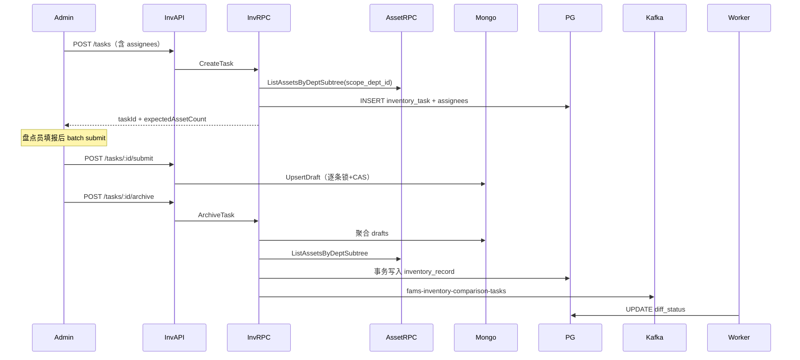

# FAMS 盘点 Operational 流程（v1）

> 对应 `inventory-api` / `inventory-rpc` / `comparison-worker`  
> API 契约见 `03-api-contract.md` §4

---

## 1. 生命周期概览



---

## 2. 创建任务（CreateTask）

### 2.1 输入校验

| 规则 | code |
| --- | --- |
| `end_time > start_time` | 42203 |
| `scope_dept_id` 在管理员子树内（role=2）或任意（role=1） | 40302 |
| `assigneeIds` 非空，每个 uid 存在且 role=3 | 40001 |
| assignee 的 department 在 scope 子树内 | 40302 |

### 2.2 计算 expectedAssetCount

```
1. user-rpc.GetDeptSubtree(scope_dept_id) → dept_ids[]
2. asset-rpc.ListAssetsByDeptIds(dept_ids, include_deleted=false)
3. expectedAssetCount = len(assets)
```

写入 `inventory_task`（status=1），批量 INSERT `inventory_task_assignee`。

### 2.3 响应

返回 task 对象 + `expectedAssetCount`（供前端进度条：`已提交 draft 数 / expected`）。

---

## 3. 获取应盘清单（GET expected-assets）

**用途**：前端 Univer 表格初始化行。

```
1. 校验任务存在且调用者有权限（创建者/指派员/上级管理员）
2. asset-rpc.ListAssetsByDeptSubtree(task.scope_dept_id)
3. 返回 assetId, assetNo, name, bookLocation（即 asset.location）
```

**不**预写 PostgreSQL `inventory_record`（归档时才固化）。

---

## 4. 批量提交草稿（Submit）

### 4.1 权限

- uid ∈ assignees；或 role≤2 且 scope 在子树内（管理员代录）

### 4.2 时间窗

```
now ∈ [start_time, end_time] 或 role≤2 管理员（放宽，仍须 task.status=1）
```

否则 → 42201

### 4.3 asset_no 校验

| 情况 | 处理 |
| --- | --- |
| asset_no 在 scope 账面存在 | 允许 |
| asset_no 不在账面 | 允许（**盘盈候选**），须 `modified_cells.found_name` 非空 |
| asset_no 在账面但 department 不在 scope 子树 | 40302 |

### 4.4 逐条处理（见 5.3 节设计）

成功写入 MongoDB `inventory_draft`：

```json
{
  "task_id": 70001,
  "asset_no": "EQUIP-2026-0001",
  "operator_id": 10003,
  "modified_cells": { ... },
  "updated_at": ISODate()
}
```

Upsert 键：`{ task_id, asset_no }`

### 4.5 expectedUpdatedAt（CAS）

- 首次写入：客户端传 `null`，Mongo upsert 直接成功
- 再次写入：客户端先 GET draft（后续可加 API）或本地缓存 `updated_at`，提交时带上；不一致 → 40901

---

## 5. 归档（ArchiveTask）

### 5.1 前置

| 条件 | code |
| --- | --- |
| task.status = 1 | 42201（已归档则幂等返回 status=2/3） |
| `now >= start_time` | 42201 |
| `now <= end_time` OR `force=true` | 42201 |
| force 仅 role≤2 | 40301 |

### 5.2 加载数据

```
drafts = mongo.find({ task_id })
book_assets = asset-rpc.ListAssetsByDeptSubtree(scope_dept_id)
book_map = { asset_no → asset }
draft_map = { asset_no → draft }
```

### 5.3 PostgreSQL 事务（核心）

**步骤 A — 已扫描记录（来自 draft）**：

对每个 `draft` in drafts：

```
asset = book_map[draft.asset_no]
if asset exists:
  INSERT inventory_record (
    task_id, asset_id=asset.id, operator_id=draft.operator_id,
    is_scanned=1, actual_location=draft.modified_cells.actual_location,
    diff_status=0  -- 待 Worker 比对
  )
else:
  -- 盘盈候选（账面无此 asset_no）
  INSERT inventory_record (
    task_id, asset_id=NULL,
    found_asset_desc=concat(found_name, ' @ ', actual_location),
    operator_id, is_scanned=1, diff_status=0
  )
```

**步骤 B — 盘亏候选（账面有、draft 无）**：

对每个 `asset` in book_assets：

```
if asset.asset_no not in draft_map:
  INSERT inventory_record (
    task_id, asset_id=asset.id,
    is_scanned=0, actual_location=NULL, diff_status=0
  )
```

**步骤 C**：

```
UPDATE inventory_task SET status=2, updated_at=now()
COMMIT
```

### 5.4 发送 Kafka

Topic：`fams-inventory-comparison-tasks`

```json
{
  "task_id": 70001,
  "timestamp": 1720236000
}
```

---

## 6. 比对 Worker（ComparisonWorker）

消费 `{ task_id }` 后：

```
records = SELECT * FROM inventory_record WHERE task_id=? AND diff_status=0
for r in records:
  if r.asset_id IS NULL:
    UPDATE diff_status=2  -- 盘盈（归档时已建盘盈行）
    metric surplus++
    continue
  if r.is_scanned=0:
    UPDATE diff_status=3  -- 盘亏
    metric loss++
    continue
  asset = asset-rpc.GetAsset(r.asset_id)
  if normalize(r.actual_location) == normalize(asset.location):
    UPDATE diff_status=1  -- 相符
    metric match++
  else:
    UPDATE diff_status=3  -- 位置不符视为盘亏（v1 简化规则）
    metric loss++

UPDATE inventory_task SET status=3
UPSERT rpt_inventory_diff_summary ...
```

**位置 normalize**：trim + 全角半角空格统一（实现放 `pkg/strnorm`）。

### 6.1 盘盈/盘亏/相符 最终定义（v1）

| diff_status | 条件 |
| --- | --- |
| 1 相符 | 账面存在 + is_scanned=1 + 位置一致 |
| 2 盘盈 | asset_id IS NULL（账面无编号） |
| 3 盘亏 | is_scanned=0 **或** 位置不一致 |

---

## 7. 与 Redis 锁的关系

锁 Key：`fams:lock:inventory:{asset_no}`（**不含 task_id**，同一 asset_no 全局互斥）

含义：同一时刻只有一个操作员写入该 asset_no 的 draft；不同任务不并行盘同一编号资产（高校场景可接受）。

---

## 8. 测试检查点

| # | 场景 | 期望 |
| --- | --- | --- |
| T1 | 创建 task scope=15 | expectedAssetCount ≥ 3（见 seed） |
| T2 | 10003、10004 同时 submit 同一 asset_no | 一个 success 一个 conflict |
| T3 | submit 未知 asset_no + found_name | draft 写入成功 |
| T4 | archive 后 | 未提交 draft 的账面资产 is_scanned=0 |
| T5 | Worker 后 | 位置相同 diff_status=1，未知编号 diff_status=2 |

---

*文档版本：v1.0 | 2026-07-07*
